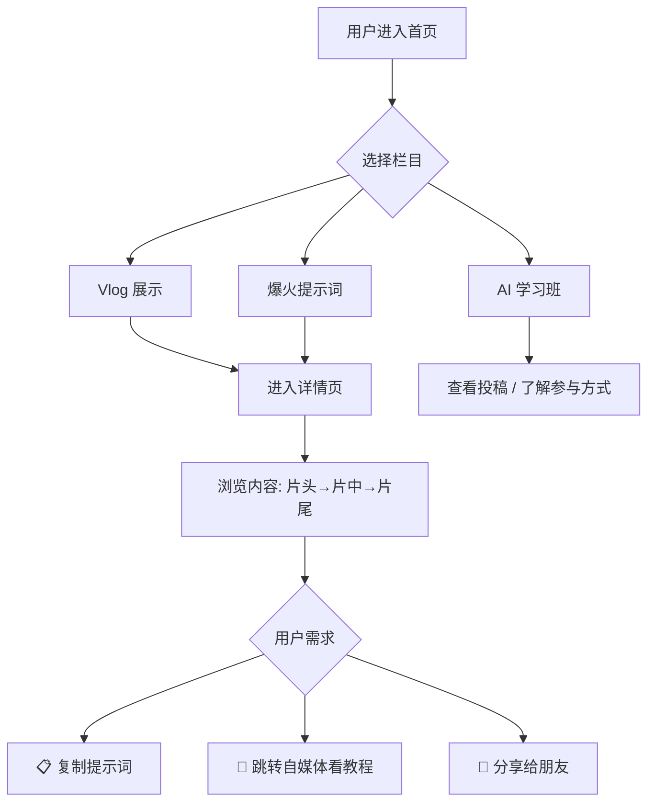
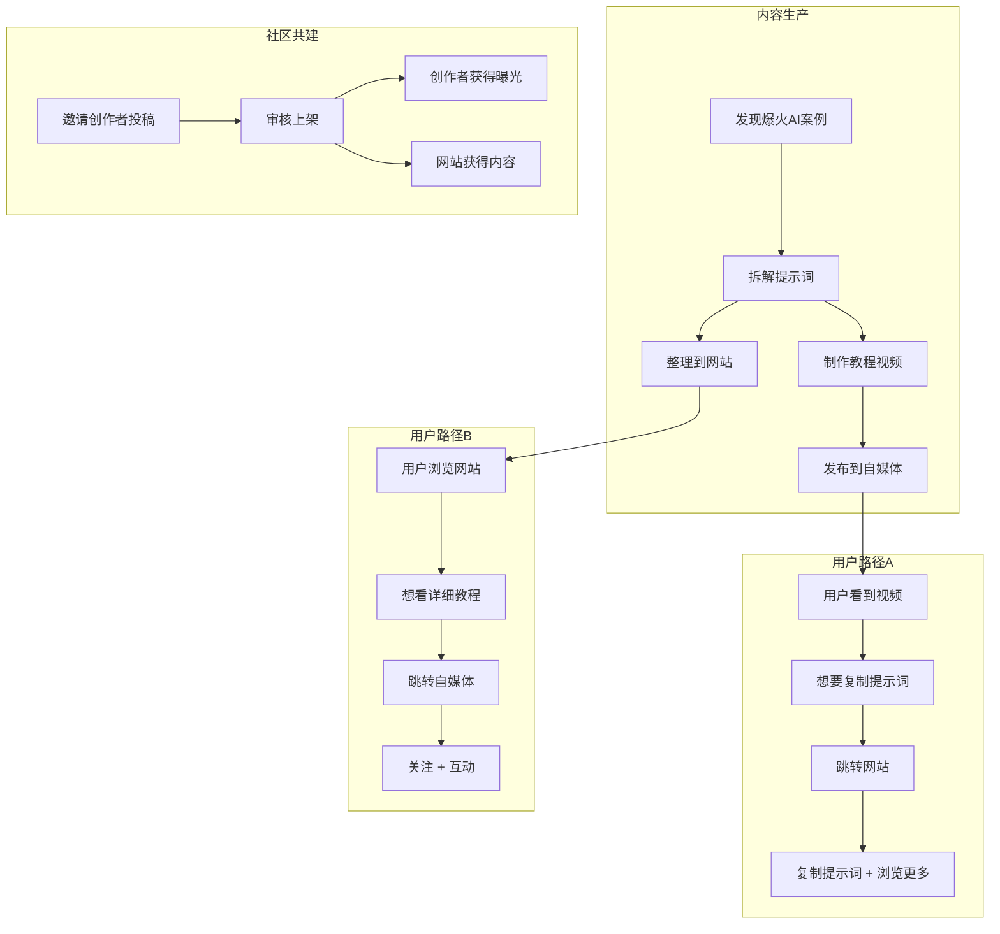

# 🎬 AI Prompt Showcase 开发者文档

> **项目名称**: AI Prompt Showcase（AI 提示词展示站）
> **版本**: v1.0
> **最后更新**: 2026-02-14

---

## 一、项目概述

### 1.1 项目定位

一个以 **内容展示** 为核心的个人品牌网站，专注于分享和拆解网上爆火的 AI 提示词案例。网站与自媒体平台（抖音/B站/小红书等）形成**双向导流闭环**：


- **网站 → 自媒体**：用户在网站浏览时，跳转自媒体平台观看详细视频教程
- **自媒体 → 网站**：用户在视频中看到提示词的效果，跳转网站直接 Copy 提示词

### 1.2 目标用户

- 对 AI 感兴趣的泛 AI 群体
- 想要学习 AI 提示词写作的创作者
- 愿意参与共建、获取曝光的 AI 内容创作者

---

## 二、内容架构

网站分为 **三大栏目**，按优先级排列：

| 栏目 | 名称 | 定位 | 内容来源 |
|:---:|:---:|:---:|:---:|
| 🥇 | **Vlog 展示** | 核心栏目 · 个人 Vlog 内容 | 站长原创 |
| 🥈 | **爆火提示词** | 重点栏目 · 拆解热门 AI 案例 | 站长搜集 + 拆解 |
| 🥉 | **AI 学习班** | 社区栏目 · 共建参与 | 社区投稿 |

### 2.1 栏目一：Vlog 展示（核心）

- 以 Vlog 为主要内容形式
- 面向整个 AI 群体（受众面更广）
- 内容按 **片头 → 片中 → 片尾** 结构化展示
- 每个 Vlog 关联对应的提示词/做法

### 2.2 栏目二：爆火视频提示词分享（重点）

- 收录网上出现的爆火 AI 案例
- 对热门案例的提示词进行**拆解分析**
- 提供可直接复制的提示词
- 可结合自媒体发布教程视频，形成导流

### 2.3 栏目三：AI 学习班（社区共建）

- 邀请用户/创作者参与内容共建
- **对投稿者**：提供曝光机会，帮助推广
- **对站长**：低成本获取优质内容
- 形式：用户提交视频 → 审核 → 上架展示

---

## 三、页面结构

### 3.1 页面层级

```
首页 (Home)
├── 导航栏（固定顶部）
│   ├── Logo / 站名
│   ├── 栏目一：Vlog 展示
│   ├── 栏目二：爆火提示词
│   ├── 栏目三：AI 学习班
│   └── 社交媒体入口
│
├── Hero 区域（轮播 / 精选推荐）
│
├── 栏目一区块：最新 Vlog 内容
│   └── 卡片列表 → 点击进入详情页
│
├── 栏目二区块：爆火提示词精选
│   └── 卡片列表 → 点击进入详情页
│
├── 栏目三区块：AI 学习班入口
│   └── 简介 + 参与方式 + 精选投稿
│
└── 页脚（Footer）
    ├── 社交媒体链接
    ├── 联系方式
    └── 版权信息

内容详情页 (Detail)
├── 视频/封面展示
├── 内容时间轴（片头 → 片中 → 片尾）
├── 提示词区域（一键复制）
├── 自媒体跳转按钮
└── 相关推荐
```

### 3.2 核心交互流程



---

## 四、详情页内容结构

每个内容条目按 **三段式** 组织：

### 片头（Opening）
- 内容概述 / 效果预览
- 吸引用户继续阅读

### 片中（Main Content）
- 详细的提示词展示
- 分步骤拆解
- 参数说明与调参建议
- **一键复制按钮**

### 片尾（Closing）
- 总结与延伸
- 自媒体跳转链接（观看完整教程）
- 相关案例推荐

---

## 五、技术架构

### 5.1 技术选型

| 模块 | 技术 | 理由 |
|:---:|:---:|:---:|
| 前端框架 | HTML + Vanilla CSS + JavaScript | 轻量、高性能、SEO 友好 |
| 构建工具 | Vite（可选） | 开发体验好、热更新 |
| 样式方案 | CSS 变量 + 自定义设计系统 | 灵活控制主题与动画 |
| 部署 | 静态托管（GitHub Pages / Vercel / Netlify） | 免费、全球 CDN |

### 5.2 项目目录结构

```
Vlog/
├── docs/                    # 文档
│   └── developer-guide.md   # 本文档
├── index.html               # 首页
├── detail.html              # 内容详情页模板
├── css/
│   ├── index.css            # 全局样式 + 设计系统
│   ├── home.css             # 首页样式
│   └── detail.css           # 详情页样式
├── js/
│   ├── main.js              # 主逻辑
│   ├── data.js              # 内容数据（JSON 格式）
│   └── clipboard.js         # 复制功能
├── assets/
│   ├── images/              # 图片资源
│   └── icons/               # 图标资源
└── README.md                # 项目说明
```

### 5.3 数据结构设计

```javascript
// 内容条目数据结构
const ContentItem = {
  id: "unique-id",
  category: "vlog" | "viral-prompts" | "ai-class",
  title: "标题",
  cover: "封面图片URL",
  date: "2026-02-14",
  author: "作者名",          // AI学习班投稿时有值
  tags: ["AI绘画", "Sora", "提示词"],
  
  // 三段式内容
  opening: {
    summary: "概述文字",
    preview: "效果预览图/视频URL"
  },
  main: {
    steps: [
      {
        title: "第一步：基础设定",
        description: "说明文字",
        prompt: "可复制的提示词内容",
        params: { model: "GPT-4", temperature: 0.7 }
      }
    ]
  },
  closing: {
    summary: "总结文字",
    socialLinks: {
      bilibili: "https://...",
      douyin: "https://...",
      xiaohongshu: "https://..."
    },
    relatedIds: ["related-id-1", "related-id-2"]
  }
};
```

---

## 六、核心功能明细

### 6.1 一键复制提示词

```javascript
// 点击复制按钮 → 复制到剪贴板 → 显示"已复制"反馈
async function copyPrompt(text) {
  await navigator.clipboard.writeText(text);
  showToast("✅ 提示词已复制到剪贴板！");
}
```

### 6.2 跨平台导流

- 每个内容条目可配置多个社交媒体链接
- 网站内嵌 CTA（Call-to-Action）按钮引导用户跳转
- 视频教程中提供网站链接，方便用户来复制提示词

### 6.3 社区共建（AI 学习班）

- 展示投稿入口与参与方式
- 投稿者获得：个人简介展示 + 社交媒体链接曝光
- 站长获得：高质量内容供给

---

## 七、设计规范

### 7.1 视觉风格

- **深色模式优先**：科技感，符合 AI 主题
- **渐变色主色调**：蓝紫渐变（#667eea → #764ba2）
- **卡片式布局**：内容以卡片形式呈现，悬浮有微动效
- **毛玻璃效果**：导航栏、弹窗使用 glassmorphism

### 7.2 字体

- 中文：`"PingFang SC", "Microsoft YaHei", sans-serif`
- 英文 / 代码：`"JetBrains Mono", "Fira Code", monospace`

### 7.3 响应式断点

| 断点 | 设备 | 布局 |
|:---:|:---:|:---:|
| ≥1200px | 桌面端 | 3列卡片 |
| 768-1199px | 平板端 | 2列卡片 |
| <768px | 手机端 | 1列卡片 |

---

## 八、运营模式

### 自媒体 ↔ 网站 双向导流闭环



---

## 九、后续扩展方向

- [ ] 搜索功能：按关键词/标签搜索提示词
- [ ] 收藏功能：用户可收藏常用提示词
- [ ] 评论/点赞：增加社区互动
- [ ] 投稿系统：在线提交投稿表单
- [ ] 多语言支持：扩展国际受众
- [ ] 数据统计：PV/UV、提示词复制次数等

---

## 十、总结

| 项目 | 说明 |
|:---:|:---|
| **核心价值** | 连接「爆火AI案例」与「用户需求」的桥梁 |
| **差异化** | 网站 ↔ 自媒体的双向导流闭环 |
| **增长策略** | 社区共建降低内容生产成本 |
| **技术特点** | 轻量级静态站，侧重展示体验与复制功能 |
